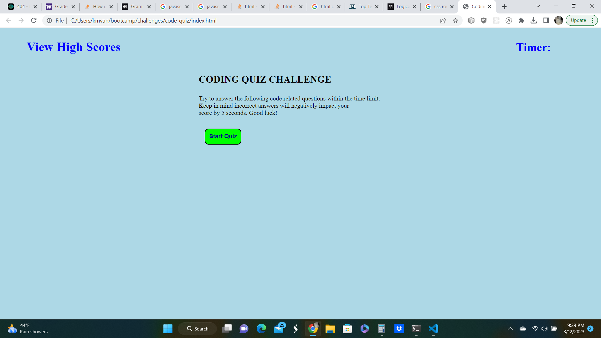
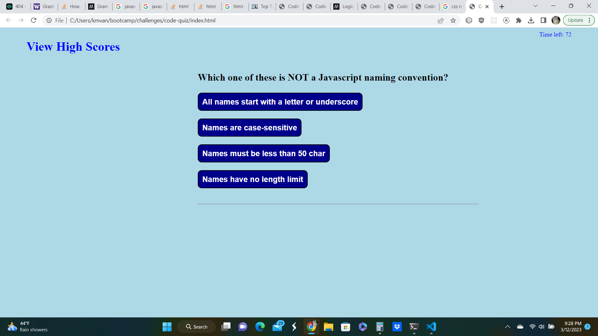
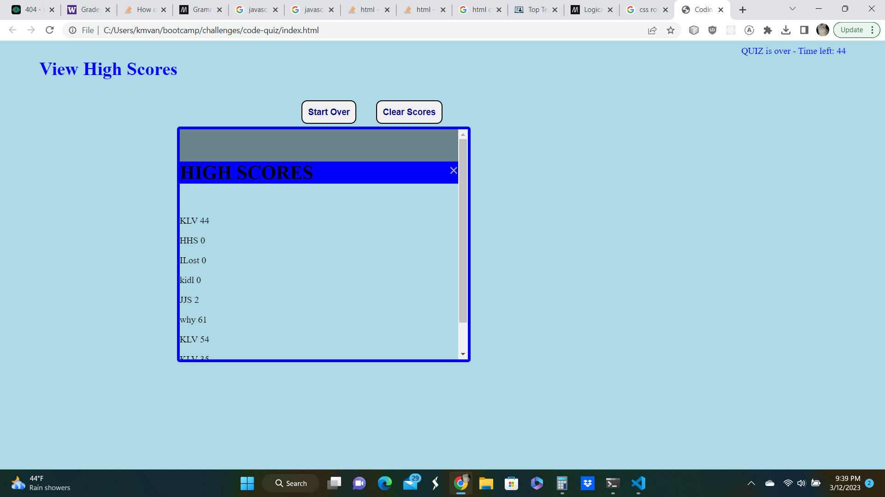

# code-quiz
## Description

This program is a timed coding quiz that can save high scores

- Used a switch to ask quiz questions while time > zero and complete > 0
- Stored high scores in local storage
- Button to clear local storage if want to clear scores
- Used CSS for hover effects
- Commented my code in Javascript
- Created a read.me

## Screenshots

### start screen

### quiz screen

### high scores screen

## Link to Project
[https://vanwykkim.github.io/code-quiz/]

## License

Please refer to the LICENSE in the repo.
